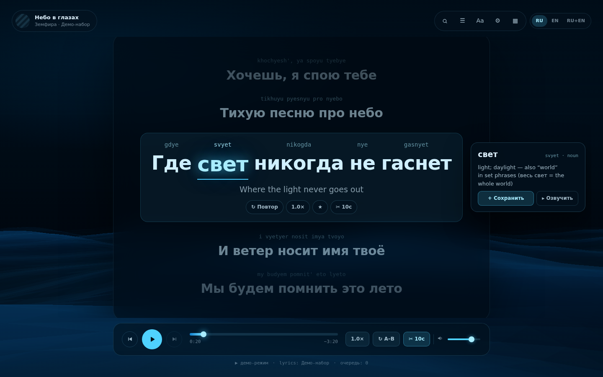
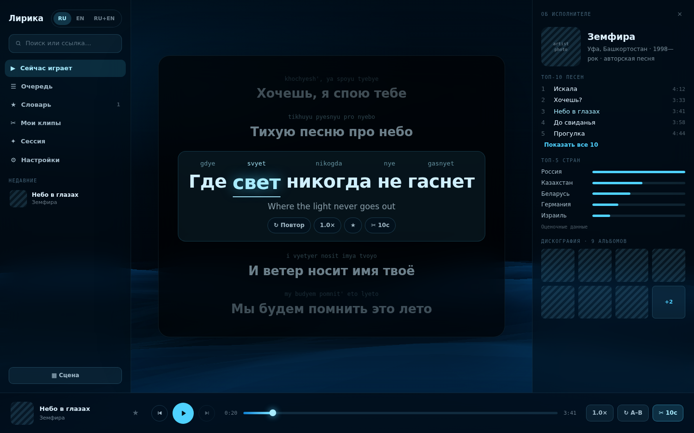
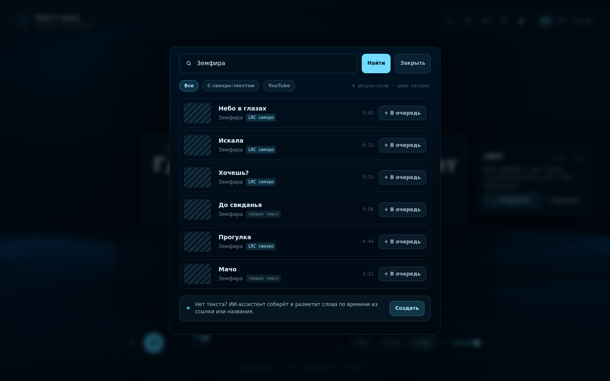
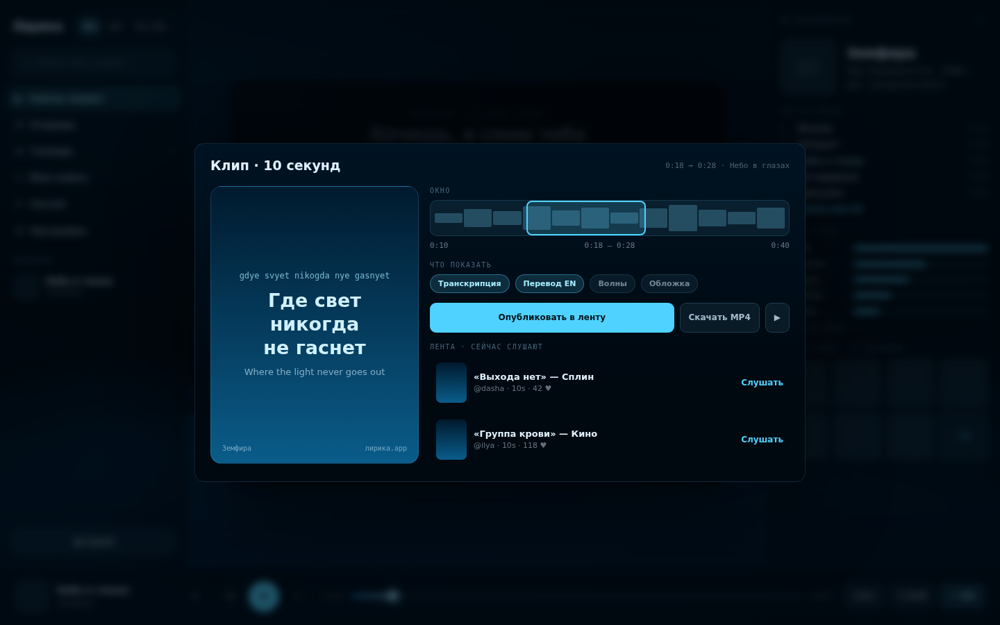
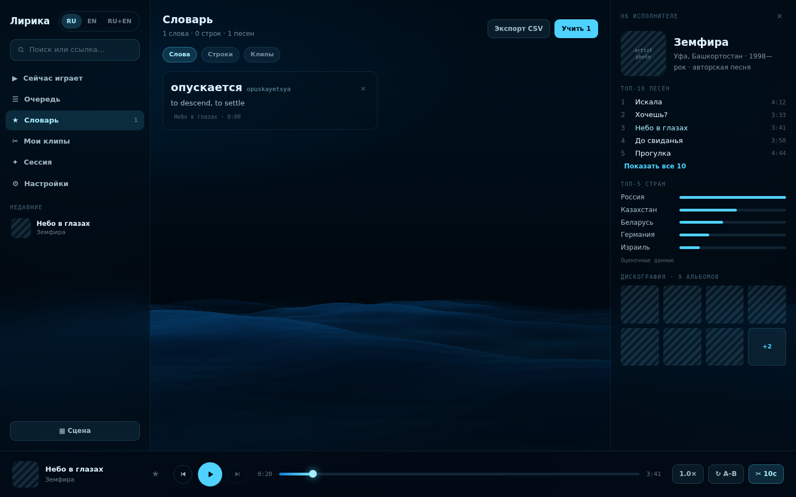
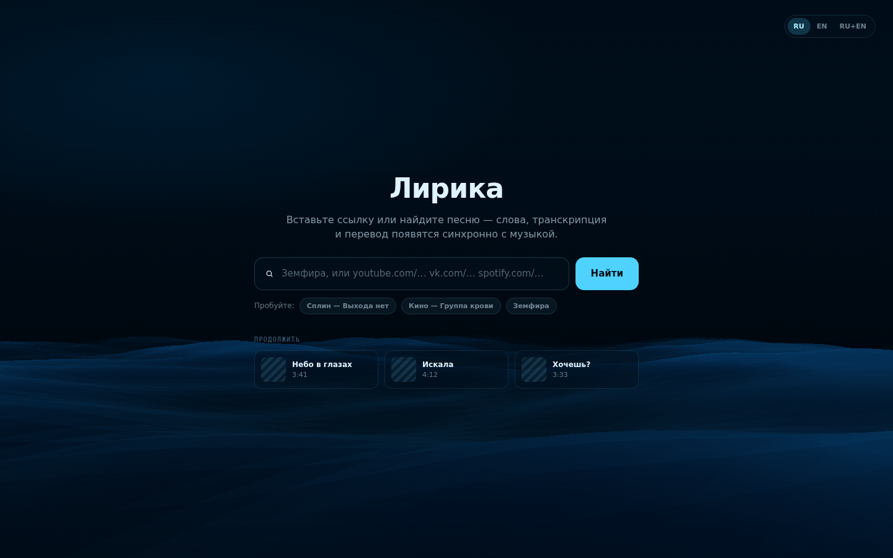
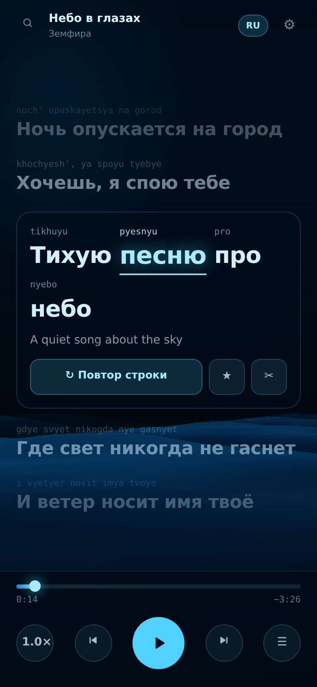
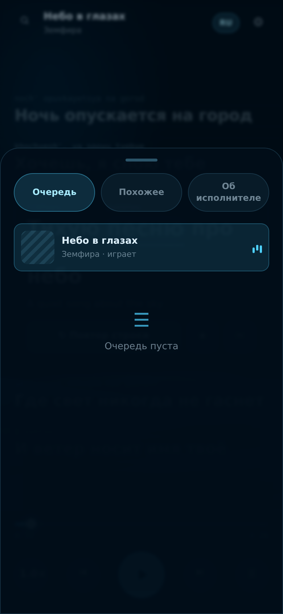
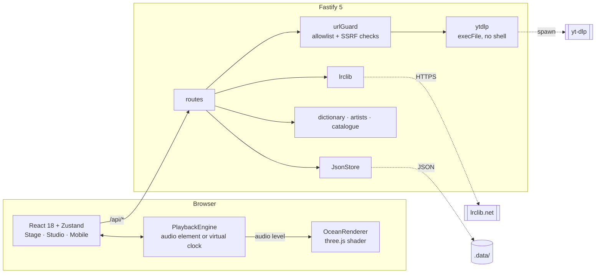

<div align="center">

# Лирика · Lyrika

**Synced Russian lyrics with pronunciation, translation and a live ocean stage.**

Tap any word for a definition. Loop a line until it sticks. Cut a ten-second clip and share it.

[](https://nodejs.org)
[](https://www.typescriptlang.org)
[](https://react.dev)
[](https://fastify.dev)
[](https://threejs.org)
[](#license)



</div>

---

## Contents

- [What this is](#what-this-is)
- [Features](#features)
- [Screens](#screens)
- [Architecture](#architecture)
- [Install and run](#install-and-run)
- [Configuration](#configuration)
- [API reference](#api-reference)
- [Project structure](#project-structure)
- [What is real and what is sample data](#what-is-real-and-what-is-sample-data)
- [Security notes](#security-notes)
- [Development](#development)
- [License](#license)

---

## What this is

Lyrika plays a song and shows its lyrics in time with the music — Cyrillic line, Latin
pronunciation above every word, English translation underneath. It is built for the
awkward middle ground between *listening* and *studying*: you can just let it play, or
you can stop on a word, hear it, save it, and loop the line at 0.75× until you can sing it.

This repository implements the **Лирика v2** design produced in
[Claude Design](https://claude.ai/design). The original design bundle is kept in
[`project/`](project/) and [`chats/`](chats/) for provenance.

### The problems v2 set out to fix

| Complaint about v1 | What v2 does |
| --- | --- |
| Lyrics are hard to read over the 3D background | Lyrics sit on a dark, blurred panel; blur depth is a user setting, and the water is deliberately weighted toward its fog colour |
| Search, player and settings crammed into one pill | Two layouts — **Stage** (one floating controller) and **Studio** (library rail, lyrics, artist panel) — switchable at any time |
| The dock hides and reappears unpredictably | The dock never auto-hides. It is always there |
| Clicking a song does nothing, with no warning | Every row shows an explicit resolving state, and a failure becomes an inline error row with a retry and a fallback suggestion |

---

## Features

### Reading and learning

- **Word-level sync.** Each word carries its own offset inside the line, so the active word lights up as it is sung.
- **Pronunciation row.** A reading-aid romanisation (not GOST) that spells out iotated vowels: `Где свет никогда не гаснет` → `gdye svyet nikogda nye gasnyet`.
- **Tap a word → definition.** Lemma-aware lookup (`гаснет` → `гаснуть`), part of speech, gloss, usage note. The card stays open while the song keeps playing.
- **Speak it.** `▸ Озвучить` reads the word aloud through the Web Speech API with a `ru-RU` voice.
- **Saved vocabulary.** Words and whole lines persist, with the track and timestamp they came from, a repeat counter, and CSV export.
- **Loop a line, or an A–B range.** Loops are enforced on the playback clock, so they hold at any speed.
- **Slow down.** 0.5× / 0.75× / 1.0× / 1.25×, from the dock or from the active line itself.

### Playing

- **Search by name or paste a URL** (YouTube, VK). Resolution runs through `yt-dlp`.
- **Honest loading and failure states.** A row that cannot be resolved says why — *"Spotify отдаёт только 30-секундные превью"* — and offers the YouTube route.
- **Queue and related tracks**, with drag handles, per-row removal, and "add all".
- **Demo playback.** Without `yt-dlp` installed the app still runs end to end on a bundled catalogue driven by a virtual clock, so every screen stays usable.

### Around the song

- **Artist panel** — origin, active years, genres, top tracks, top countries, full discography grid.
- **Clip composer** — pick a 10-second window on the waveform, choose what to show (pronunciation, translation, waves, artwork), publish to the feed.
- **AI lyric assistant** — the "no lyrics anywhere → draft one" path, wired end to end and clearly labelled as a simulation until a transcription model is configured.
- **Listening session** — a shared room code for listening together.

### Presentation

- **Live ocean background** in WebGL: four summed wave trains, screen-space normals, specular sparkle, and audio reactivity from an `AnalyserNode` (with a musical synthetic fallback when the stream is cross-origin).
- **Four presets** — Штиль, Прибой, Ночь, Лагуна — plus wave height, reactivity and blur sliders.
- **Eco mode** drops WebGL entirely for a CSS gradient stand-in.
- **Bilingual UI** — Russian, English, or both. `prefers-reduced-motion` is respected throughout.

---

## Screens

<table>
<tr>
<td width="50%"><br><b>Studio</b> — library rail, lyrics, artist panel</td>
<td width="50%"><br><b>Search</b> — synced-lyric badges, per-row states</td>
</tr>
<tr>
<td><br><b>Clip composer</b> — 10s window, share to feed</td>
<td><br><b>Vocabulary</b> — saved words and lines</td>
</tr>
<tr>
<td><br><b>Landing</b> — paste a link or search</td>
<td align="center"> <br><b>Mobile</b> — now playing and queue sheet</td>
</tr>
</table>

---

## Architecture



Three workspaces:

| Package | Role |
| --- | --- |
| `@lyrika/shared` | Types and constants used by both sides — one definition of `Track`, `Lyrics`, `Clip`, the wave themes |
| `@lyrika/server` | Fastify API: search, resolve, lyrics, dictionary, artist, vocabulary, clips |
| `@lyrika/client` | Vite + React + three.js UI |

**Playback is one interface with two backends.** Resolved streams play through an
`<audio>` element; demo tracks advance a virtual clock. The UI cannot tell them apart,
which is what keeps the whole app demonstrable without a working `yt-dlp`.

**The audio level bypasses React.** The analyser writes to a module-level ref that the
ocean's render loop reads each frame — a 60 fps signal never triggers a re-render.

---

## Install and run

### Run the whole thing

This is one repo with three workspaces (`shared`, `server`, `client`). You never
`cd` into them — every command below is run **from the repository root**, and a
single `npm run dev` starts all three together.

```bash
# From the repo root — clone, install, run everything
git clone https://github.com/yaluft/LiveLyricsRU.git
cd LiveLyricsRU

npm install        # installs all workspaces and builds @lyrika/shared
npm run dev        # shared (watch) + API (:8787) + client (:5173), one process

# then open  →  http://localhost:5173
```

`npm run dev` builds `@lyrika/shared` first (the client and server both import
it), then runs all three concurrently with hot reload; Vite proxies `/api` to the
API. Optional: set `GEMINI_API_KEY` for real translation and the AI assistant,
and install `yt-dlp` for real streams — the app runs on the demo catalogue
without either.

Prefer a single container instead? See [Docker](#docker) — `docker compose up
--build` builds and serves the whole stack on one port.

### Requirements

- **Node.js ≥ 20** (developed on 22)
- **`yt-dlp`** *(optional)* — for real stream resolution. Without it the app runs on the demo catalogue.
- **`ffmpeg`** *(optional)* — used by `yt-dlp` for some formats.

### Local development

```bash
git clone https://github.com/yaluft/LiveLyricsRU.git
cd LiveLyricsRU

npm install
npm run dev
```

`npm install` builds `@lyrika/shared` via its `prepare` script, and `npm run dev`
rebuilds it before starting — the client and server both import it, so it has to
exist first. `shared` also runs in watch mode alongside them.

| | |
| --- | --- |
| Client | http://localhost:5173 |
| API | http://localhost:8787 |

`npm run dev` runs both with hot reload; Vite proxies `/api` to the server.

<details>
<summary><b>Installing yt-dlp</b></summary>

```bash
# macOS
brew install yt-dlp ffmpeg

# Debian / Ubuntu
sudo apt install ffmpeg
sudo curl -L https://github.com/yt-dlp/yt-dlp/releases/latest/download/yt-dlp -o /usr/local/bin/yt-dlp
sudo chmod a+rx /usr/local/bin/yt-dlp

# pipx, any platform
pipx install yt-dlp
```

Confirm the API can see it:

```bash
curl -s localhost:8787/api/health
# {"status":"ok","ytDlp":true,"gemini":false,"catalogSize":12}
```

</details>

### Production build

```bash
npm run build          # shared → server → client
SERVE_CLIENT=true npm start
```

The API then serves the built client from the same origin on `PORT` (default `8787`).

### Docker

```bash
docker compose up --build
```

Serves on **http://localhost:8080** through nginx, with `yt-dlp` and `ffmpeg` baked into
the image and saved vocabulary on a named volume.

Single container, no nginx:

```bash
docker build -t lyrika .
docker run -p 8787:8787 -v lyrika-data:/app/.data lyrika
```

---

## Configuration

Copy `.env.example` to `.env`. Everything has a working default.

| Variable | Default | Purpose |
| --- | --- | --- |
| `PORT` | `8787` | API port |
| `HOST` | `0.0.0.0` | Bind address |
| `LOG_LEVEL` | `info` | Pino level |
| `CORS_ORIGIN` | `http://localhost:5173` | Comma-separated origins, or `*` |
| `YT_DLP_PATH` | `yt-dlp` | Path to the binary; when missing, resolution degrades to the demo catalogue |
| `YT_DLP_TIMEOUT_MS` | `20000` | Kill a resolve that hangs |
| `LRCLIB_BASE_URL` | `https://lrclib.net` | Lyric source |
| `LRCLIB_TIMEOUT_MS` | `6000` | Lyric lookup timeout |
| `SERVE_CLIENT` | `false` | Serve the built client from the API process |
| `CLIENT_DIR` | `../client/dist` | Where that build lives |
| `DATA_DIR` | `./.data` | Saved words, lines and clips |

Client-side preferences — language, layout, wave preset, blur, eco mode, lyric-source
order — live in `localStorage` under `lyrika.settings`.

---

## API reference

<details open>
<summary><b>Playback</b></summary>

| Method | Path | Description |
| --- | --- | --- |
| `GET` | `/api/health` | Status, whether `yt-dlp` is available, catalogue size |
| `GET` | `/api/search?q=` | Search by term, or resolve a pasted URL. `sampled: true` means the demo catalogue answered |
| `POST` | `/api/resolve` | `{ trackId }` or `{ url }` → `{ track, stream }` |

</details>

<details open>
<summary><b>Lyrics and language</b></summary>

| Method | Path | Description |
| --- | --- | --- |
| `GET` | `/api/lyrics/:trackId?title=&artist=&duration=` | LRCLIB first, demo lyrics as fallback, `404` when nothing matches |
| `GET` | `/api/define?word=` | Lemma-aware definition; always answers, even if only with a romanisation |
| `GET` | `/api/artist?name=` | Artist profile (sample data, `estimated: true`) |
| `POST` | `/api/ai/lyrics` | `{ query, trackId?, withTranslit?, withTranslation? }` → a draft, always `simulated: true` |

</details>

<details>
<summary><b>Library</b></summary>

| Method | Path | Description |
| --- | --- | --- |
| `GET` | `/api/vocabulary` | `{ words, lines }` |
| `POST` | `/api/vocabulary/words` | Save a word; re-saving increments `seenCount` |
| `DELETE` | `/api/vocabulary/words/:id` | Remove a word |
| `POST` | `/api/vocabulary/lines` | Save a line |
| `DELETE` | `/api/vocabulary/lines/:id` | Remove a line |
| `GET` | `/api/feed` | Published clips, seeded with samples |
| `POST` | `/api/clips` | Publish a clip |
| `DELETE` | `/api/clips/:id` | Remove a clip |

</details>

Errors are uniform:

```jsonc
{
  "error": "resolve_failed",
  "message": "Spotify отдаёт только 30-секундные превью",
  "hint": "Попробуйте вариант с YouTube."   // rendered as the row's fallback action
}
```

---

## Project structure

```
├── shared/src/index.ts       Types + wave themes shared by client and server
├── server/src
│   ├── config.ts             Env parsing, all defaults
│   ├── routes/index.ts       Every endpoint
│   ├── services
│   │   ├── urlGuard.ts       Host allowlist, SSRF rejection  ← unit tested
│   │   ├── ytdlp.ts          execFile wrapper, never a shell
│   │   ├── lrclib.ts         Lyric lookup
│   │   └── ai.ts             Draft-lyric placeholder
│   ├── lib
│   │   ├── transliterate.ts  Reading-aid romanisation  ← unit tested
│   │   ├── lrc.ts            LRC parsing → line/word model  ← unit tested
│   │   └── store.ts          Atomic JSON persistence
│   └── data                  Demo catalogue, glossary, artists, feed seed
└── client/src
    ├── audio/engine.ts       Audio element + virtual clock behind one interface
    ├── bg/ocean.ts           three.js wave shader
    ├── state                 settings · player · library · ui (Zustand)
    ├── components            Stage · Studio · Mobile + every screen
    └── styles                Design tokens through to screen CSS
```

---

## What is real and what is sample data

Stated plainly, because a demo that pretends is worse than one that admits.

| Area | Status |
| --- | --- |
| Synced lyrics | **Real** — LRCLIB, parsed from LRC including multi-timestamp lines |
| Stream resolution | **Real** — `yt-dlp`, with host allowlisting |
| Romanisation | **Real** — every line and word, computed from the text |
| Word definitions | **Real lookup, bundled glossary.** ~70 lemmas with inflected forms; unknown words return a romanisation-only card |
| Playback, loops, speed, queue, vocabulary, clips | **Real** |
| Demo catalogue lyrics | **Original demo text**, not the published lyrics of the songs they are attached to. Real lyrics only ever come from the configured sources at runtime |
| Artist bio, top countries, discography | **Sample data**, flagged `estimated: true` and labelled in the UI |
| Clip feed | **Local only** — your clips persist to disk; other authors are seed data |
| AI lyric assistant | **Simulated** — the route and the UI path are real, no transcription model is wired up. Every response is flagged `simulated: true` |
| Listening session | **Local only** — the room code generates, cross-device sync is not implemented |
| MP4 clip export | **Not implemented** — the button says so |

---

## Security notes

Pasted URLs and shell-outs are the risky surface here, so:

- **`yt-dlp` is never invoked through a shell.** `execFile` with an argv array, and every
  caller-supplied value sits after `--` so it can never be parsed as an option.
- **Hosts are allowlisted** before any network or subprocess work: YouTube, VK, Spotify.
  Everything else is refused.
- **SSRF defences** — non-HTTP protocols, IP literals (including IPv6 and link-local
  `169.254.169.254`), embedded credentials, and lookalike hosts such as
  `youtube.com.evil.example` are all rejected. These cases are covered by unit tests.
- **Timeouts and output caps** on every subprocess and outbound fetch.
- **Atomic writes** — the JSON store writes to a temp file and renames, and serialises
  concurrent writers, so a crash cannot leave a half-written vocabulary.

```bash
npm test   # includes the URL-guard, LRC-parser and romanisation suites
```

---

## Development

```bash
npm run dev         # client + server, hot reload
npm run build       # shared → server → client
npm run typecheck   # strict tsc across all three workspaces
npm test            # node:test suites
npm run test:e2e    # Playwright smoke suite against the dev server
npm start           # run the built server
```

`npm run test:e2e` drives a real Chromium browser through the app (search →
play → lyrics → loops → layout switch → the SSRF guard) via Playwright,
started against `npm run dev`. A `.mcp.json` in the repo root also wires up
the `@playwright/mcp` server for interactive browser-driven work from an
MCP-aware Claude Code session.

TypeScript runs in strict mode with `noUncheckedIndexedAccess` and `noUnusedLocals`
everywhere. There is no `any` in application code.

### Keyboard

| Key | Action |
| --- | --- |
| <kbd>Space</kbd> | Play / pause |
| <kbd>←</kbd> <kbd>→</kbd> | Seek ∓5s |
| <kbd>/</kbd> | Open search |
| <kbd>Esc</kbd> | Close the topmost panel |

---

## License

MIT. See [LICENSE](LICENSE).

Lyrika does not host or redistribute music or lyrics. It reads from sources you configure
and plays streams you resolve yourself — respect the terms of those services and the
copyright of the works you look up.
